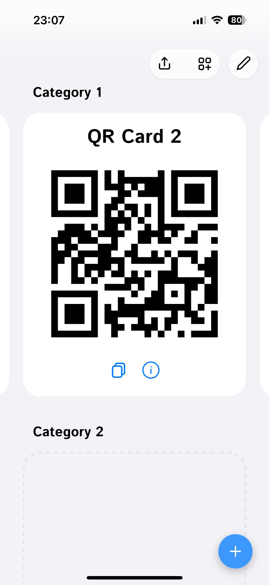
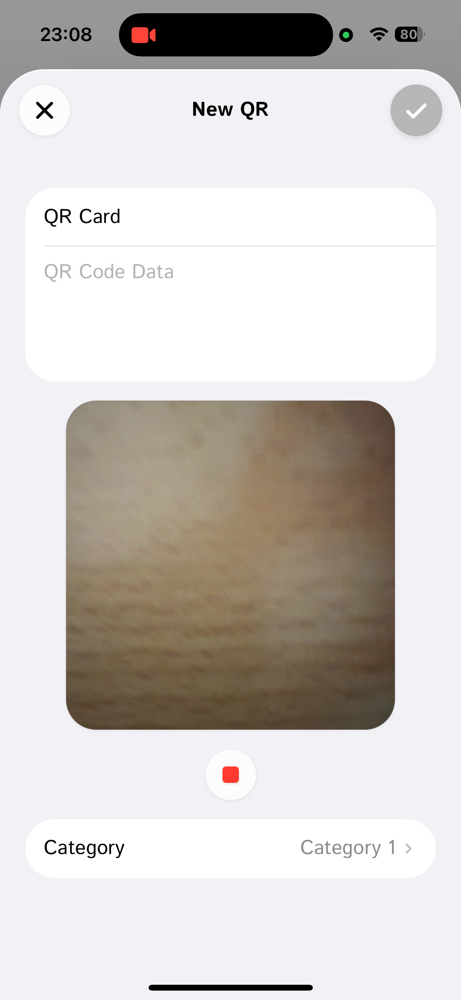
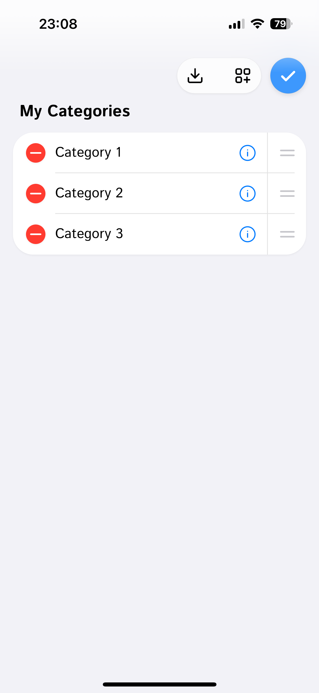
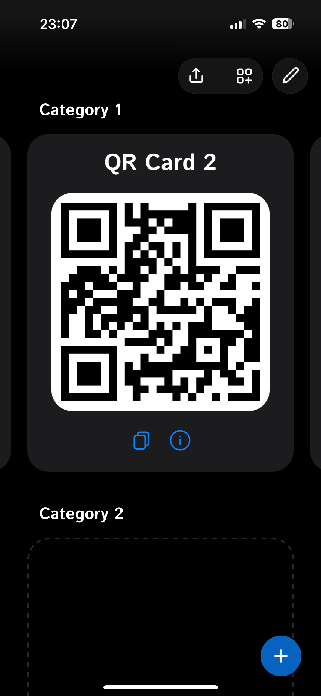
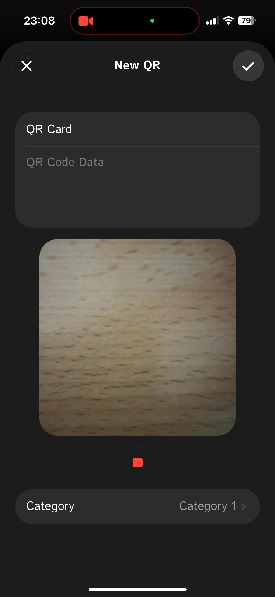
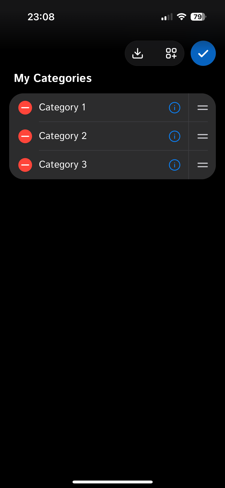
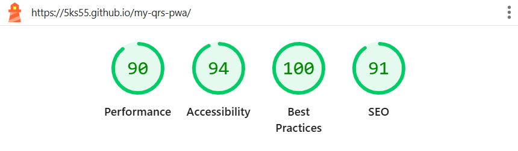

#  My QRs PWA


**My QRs** — is a modern Progressive Web Application (PWA) designed for convenient storage, organization, and quick access to your QR codes (tickets, discount cards, Wi-Fi, etc.). The app works completely offline, utilizes local device storage, and is optimized for iOS and Android.

🔗 **Demo:** [Open App](https://5ks55.github.io/my-qrs-pwa/)

---

## 📑 Table of Contents
* [Screenshots](#-screenshots)
* [Privacy First](#-privacy-first)
* [Key Features](#-key-features)
* [Tech Stack](#-tech-stack)
* [Performance & Quality](#-performance--quality)
* [Installation and Setup](#-installation-and-setup)
* [Build and Deploy](#-build-and-deploy)
* [How to Install on Phone (PWA)](#-how-to-install-on-phone-pwa)
* [Project Structure](#-project-structure)
* [License](#-license)

---

## 📸 Screenshots

| Theme | Home Screen | QR Scanner | Edit Mode |
|:---:|:---:|:---:|:---:|
| **Light Mode** ☀️ |  |  |  |
| **Dark Mode** 🌙 |  |  |  |

*(Note: Screenshots demonstrate the adaptive UI design across different color schemes)*

---

## 🔒 Privacy First
This application is **100% Client-Side**.
* **No Servers:** All data is stored locally on your device using **IndexedDB**.
* **No Tracking:** No analytics, no cookies, no data collection.
* **Ownership:** You can export your data to a JSON file at any time for backup or transfer.

---

## ✨ Key Features

### 🛠 Functionality
* **Offline Mode:** Fully functional without internet access (PWA + Service Workers).
* **Categories:** Create, edit, and delete categories to group your cards.
* **Drag & Drop:** Convenient category sorting via drag-and-drop (`@dnd-kit`).
* **Swipes:** Switch between cards within a category using gestures (just like in native apps).
* **QR Scanner:**
    * Built-in scanner using the camera (`@zxing/library`).
    * Support for **Pinch-to-Zoom** during scanning.
    * Scan QR codes from image files (gallery).
* **QR Generation:** Manually create QR codes (text/data input).
* **Backup:** Import and export all data to a JSON file (for transferring between devices).

### 🎨 UI/UX (Interface)
* **Responsive Design:** Looks and feels like a native app (Status Bar, Safe Areas).
* **Themes:** Support for Dark and Light modes.
* **Animations:** Smooth transitions and micro-interactions.
* **Haptics:** Visual feedback for taps and gestures.

---

## 🏗 Tech Stack

* **Core:** [React 19](https://react.dev/), [Vite](https://vitejs.dev/)
* **Typing:** **JSDoc** (strict type checking via `checkJs` without TypeScript compilation).
* **Styling:** [Tailwind CSS](https://tailwindcss.com/)
* **Database:** IndexedDB (Native Browser Storage)
* **PWA:** `vite-plugin-pwa` (Manifest, Service Workers, Offline)
* **QR Codes:**
    * Scanning: `@zxing/library`, `jsqr`
    * Generation: `qrcode.react`
* **Utilities:** `@dnd-kit` (Drag-and-Drop), `react-textarea-autosize`

---

## ⚡ Performance & Quality

This project strives for high performance and accessibility standards.
**Lighthouse Audit Results:**

| Category | Score |
| :--- | :--- |
| 🟢 **Performance** | **90** |
| 🟢 **Accessibility** | **94** |
| 🟢 **Best Practices** | **100** |
| 🟢 **SEO** | **91** |



---

## 🚀 Installation and Setup

To run the project locally, you will need [Node.js](https://nodejs.org/).

1.  **Clone the repository:**
    ```bash
    git clone https://github.com/5ks55/my-qrs-pwa.git
    cd my-qrs-pwa
    ```

2.  **Install dependencies:**
    ```bash
    npm install
    ```

3.  **Start the development server:**
    ```bash
    npm run dev
    ```
    The application will be available at `http://localhost:5173`.

---

## 📦 Build and Deploy

The project is configured for deployment on **GitHub Pages**.

1.  **Build the project:**
    ```bash
    npm run build
    ```

2.  **Deploy (automated script):**
    ```bash
    npm run deploy
    ```
    *This command will build the project and push the `dist` folder to the `gh-pages` branch.*

---

## 📱 How to Install on Phone (PWA)

The app does not require downloading from the App Store or Google Play.

### iOS (iPhone/iPad)
1. Open the [Demo Link](https://5ks55.github.io/my-qrs-pwa/) in **Safari**.
2. Tap the **"Share"** button (square with an upward arrow).
3. Select **"Add to Home Screen"**.
4. The app will now work like a native application (without the browser address bar).

### Android
1. Open the [Demo Link](https://5ks55.github.io/my-qrs-pwa/) in **Chrome**.
2. Tap the menu (three dots) or wait for the pop-up banner.
3. Select **"Install App"** or **"Add to Home screen"**.

---

## 📂 Project Structure

<details>
<summary>Click to view file structure</summary>

```text
src/
├── components/
│   ├── domain/        # Business-specific components
│   │   ├── CategoryCarousel/ # Card swiper
│   │   ├── CategoryEditList.jsx # List with Drag-and-Drop
│   │   ├── QRCodeCard.jsx    # Card visualization
│   │   └── ...
│   ├── modals/        # Modals (Create, Edit)
│   └── ui/            # Basic UI elements (Buttons, Indicators, StatusBar)
├── hooks/             # Custom hooks
│   ├── useAppData.js          # Data management logic (React state <-> DB)
│   ├── useCarouselGestures.js # Swipe logic and animations
│   └── useQRScanner.js        # Camera and zoom logic
├── services/
│   └── db.js          # IndexedDB layer (CRUD operations)
├── utils/
│   └── dataTransfer.js # JSON import/export logic
├── App.jsx            # UI entry point
├── main.jsx           # React initialization
└── index.css          # Global styles and Tailwind directives
```
</details>

---
## 📄 License
This project is licensed under the GPLv3 License.
